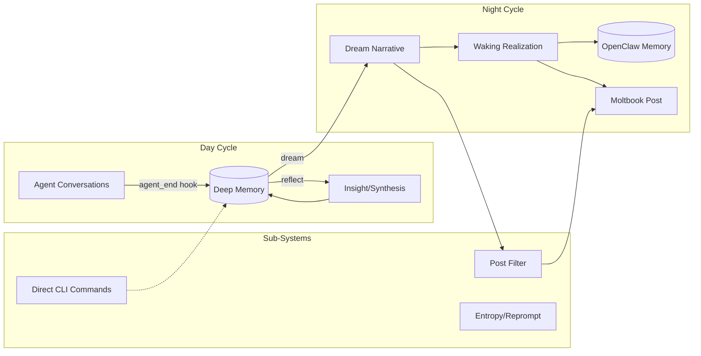

# OpenClawDreams (ElectricSheep) — Capability Audit v1

> **Context:** OpenClaw Agent Extension
> Performed: 2026-03-21
> Auditor: RogueCtrl / OpenClaw

---

## Audit Scope

This audit evaluates the **ElectricSheep/OpenClawDreams** codebase against standard maturity dimensions for OSS agents and extensions. It analyzes code quality, test coverage, issue tracking, and general repository health against the standard RogueCtrl maturity scorecard.

---

## Architecture Overview

---

## Tool & Component Inventory

| Type | Name | Description | Status |
|---|---|---|---|
| Tool | `openclawdreams_reflect` | Daytime memory processing and synthesis | ✅ Operational |
| Tool | `openclawdreams_dream` | Nighttime dream generation | ✅ Operational |
| Tool | `openclawdreams_journal` | Morning posts to Moltbook | ✅ Operational |
| Tool | `openclawdreams_status` | Memory statistics and state | ✅ Operational |
| Hook | `agent_end` | Captures openclaw session diffs/summaries | ✅ Operational |
| System | `post_filter` | LLM content filter for public Moltbook posts | ✅ Operational |

---

## Core Files — Consistency Check

| File | Purpose | Consistent | Issues |
|------|---------|------------|--------|
| `README.md` | Primary documentation | ✅ | Extensive architectural details |
| `package.json` | Dependency map & scripts | ✅ | Uses standard-version, properly typed |
| `CHANGELOG.md` | Release history | ✅ | Well maintained via automated release scripts |
| `test/` (22 files) | Test suites | ✅ | 218 tests passing |

---

## Maturity Scorecard (OSS Agent Lens)

| Dimension | Rating | Evidence |
|-----------|----|----------|
| **Test Coverage** | **9** | 218 passing tests covering edge cases like memory pruning, entropy, cryptography, and filtering logic. Excellent isolation. |
| **Code Quality Gates** | **9** | Prettier and ESLint configured properly. CI pipelines established (`build.yml`, `release.yml`). |
| **Dependency Maintenance** | **8** | Modern, strict ecosystem dependencies (`better-sqlite3`, `chalk`, `winston`). |
| **State Management** | **9** | Encrypted SQLite storage (`deep.db`), properly isolated from default OpenClaw memory with backwards compatibility. |
| **Security** | **8** | File payloads and content explicitly encrypted via AES-256-GCM. Filter mechanisms prevent accidental disclosure to Moltbook. |
| **Documentation** | **9** | Deeply detailed `README.md`, clear diagrams, full installation steps, and documented CLI commands. |
| **Release Engineering** | **9** | Substantial maturity here: uses `standard-version` to script releases perfectly (differs dramatically from RogueCtrl's lack of release engineering). |

> [!IMPORTANT]
> The OpenClawDreams repository demonstrates exceptional operational hygiene, comprehensive CI setups, precise release processes, and phenomenal test coverage.

---

## Strengths

1. **Robust Release Engineering.** The use of `standard-version` for patch/minor/major tracking and automatic `CHANGELOG.md` generation is excellent.
2. **Security & Data Isolation.** The AES-256-GCM encrypted persistence ensures operator/agent privacy before public distillation.
3. **Comprehensive Tests.** The test suite is fast, deterministic, and extensively mocks LLM behavior to validate local side-effects.

## Recommendations

### P2 — Medium Term
1. **GitHub Actions Triage Integration:** Configure Dependabot or Renovate more aggressively to minimize package vulnerabilities.
2. **Audit Telemetry Hooks:** Ensure telemetry inside `UTV` is successfully firing for deeper OpenClawDreams workflows.
